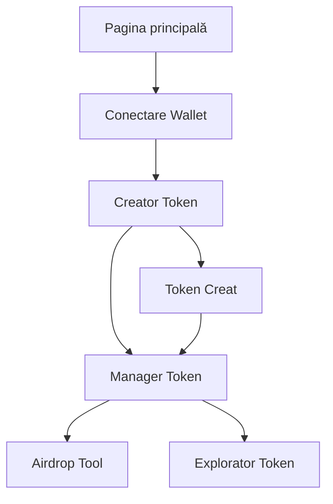

## 1. Prezentare generală a produsului
Aplicație web pentru crearea și lansarea de meme coins pe blockchain-ul Solana. Platforma permite utilizatorilor să creeze token-uri personalizate, să gestioneze metadatele, să efectueze airdrop-uri și să interacționeze cu contracte inteligente fără cunoștințe de programare.

- Problema rezolvată: Proces complex și costisitor de creare token-uri pe Solana
- Utilizatori: Cripto entuziaști, dezvoltatori începători, comunități meme
- Valoare: Democratizarea accesului la crearea de token-uri pe Solana cu costuri minime

## 2. Funcționalități principale

### 2.1 Roluri utilizatori
| Rol | Metodă de înregistrare | Permisiuni principale |
|------|------------------------|----------------------|
| Utilizator standard | Conectare wallet Solana | Poate crea token-uri, efectua airdrop-uri, gestiona token-uri proprii |
| Deținător token | Automat la creare token | Poate modifica metadate, gestiona supply, efectua airdrop-uri |

### 2.2 Module funcționale
Aplicația noastră pentru crearea de meme coins pe Solana conține următoarele pagini principale:

1. **Pagina principală**: Prezentare platformă, statistici, buton creare token
2. **Creator token**: Formular creare token, upload imagine, setări metadate
3. **Manager token**: Dashboard pentru token-uri create, statistici, acțiuni
4. **Airdrop tool**: Interfață pentru distribuire token-uri multiple
5. **Explorator token**: Căutare și vizualizare token-uri existente

### 2.3 Detalii pagini
| Numele paginii | Numele modulului | Descrierea funcționalității |
|----------------|------------------|----------------------------|
| Pagina principală | Hero section | Afișează statistici live despre token-uri create, volum tranzacționat, trending coins |
| Pagina principală | Conectare wallet | Buton pentru conectare Phantom/Solflare cu afișare adresă și sold SOL |
| Creator token | Formular token | Câmpuri pentru nume, simbol, supply total, decimals, descriere |
| Creator token | Upload imagine | Drag & drop pentru încărcare logo token cu previzualizare |
| Creator token | Setări avansate | Opțiuni pentru revoke authorities, freeze authority, mutable metadata |
| Creator token | Costuri estimare | Afișare costuri tranzacții SOL în timp real |
| Manager token | Lista token-uri | Tabel cu token-urile create de utilizator cu status și acțiuni |
| Manager token | Statistici token | Grafice cu evoluție preț, volum, deținători |
| Manager token | Acțiuni token | Butoane pentru mint, burn, update metadata, revoke authorities |
| Airdrop tool | Upload lista adrese | CSV upload sau introducere manuală adrese pentru airdrop |
| Airdrop tool | Configurare distribuire | Setare cantitate per adresă, total de distribuit |
| Airdrop tool | Progres airdrop | Afișare status distribuire, tranzacții eșuate, retry |
| Explorator token | Căutare token | Căutare după adresă, simbol, nume cu autocomplete |
| Explorator token | Detalii token | Afișare metadate, supply, holders, tranzacții recente |

## 3. Procese principale

### Flux creare token:
1. Utilizatorul conectează wallet-ul Solana (Phantom/Solflare)
2. Accesează pagina de creare token din navigare
3. Completează formularul cu detalii token (nume, simbol, supply, decimals)
4. Încarcă imaginea pentru logo (upload direct la IPFS)
5. Configurează opțiuni avansate (revoke authorities, freeze, mutable)
6. Previzualizează costurile totale în SOL
7. Confirmă și semnează tranzacția
8. Primește adresa token-ului și link către Solscan

### Flux airdrop:
1. Utilizatorul selectează token-ul creat pentru airdrop
2. Încarcă lista de adrese (CSV sau manual)
3. Setează cantitatea de distribuit per adresă
4. Confirmă totalul și costurile de tranzacție
5. Execută distribuirea în loturi
6. Monitorizează progresul și statusul fiecărei tranzacții

### Flux management token:
1. Utilizatorul accesează dashboard-ul personal
2. Vede lista tuturor token-urilor create
3. Selectează un token pentru management detaliat
4. Poate efectua acțiuni: mint, burn, update metadata
5. Poate revoca authorities pentru descentralizare completă

## 4. Design interfață utilizator

### 4.1 Stil design
- Culori principale: Mov electric (#8B5CF6), Albastru Solana (#9945FF), Verde profit (#10B981)
- Culori secundare: Gri închis (#1F2937), Gri deschis (#F3F4F6)
- Stil butoane: Rounded corners, gradient backgrounds, hover effects
- Font: Inter pentru text, Mono pentru adrese și cod
- Layout: Card-based design cu shadow effects
- Iconițe: Emoji și SVG icons stilizate

### 4.2 Prezentare generală pagini
| Numele paginii | Numele modulului | Elemente UI |
|----------------|------------------|-------------|
| Pagina principală | Hero section | Gradient background animat, statistici în cards, CTA buton prominent |
| Creator token | Formular token | Input fields cu iconițe, validare real-time, progress indicator |
| Manager token | Lista token-uri | Tabel responsive cu status badges, acțiuni dropdown |
| Airdrop tool | Upload lista | Drag & drop zone, preview tabel, progress bar |

### 4.3 Responsive design
- Abordare desktop-first cu adaptare pentru mobile
- Breakpoints: 640px, 768px, 1024px, 1280px
- Touch optimization pentru butoane și formulari
- Sidebar navigation devine bottom navigation pe mobil

### 4.4 Interacțiuni speciale
- Loading states cu animații Solana
- Success toasts cu adresa tranzacției
- Error handling cu mesaje informative
- Real-time SOL price pentru cost estimation