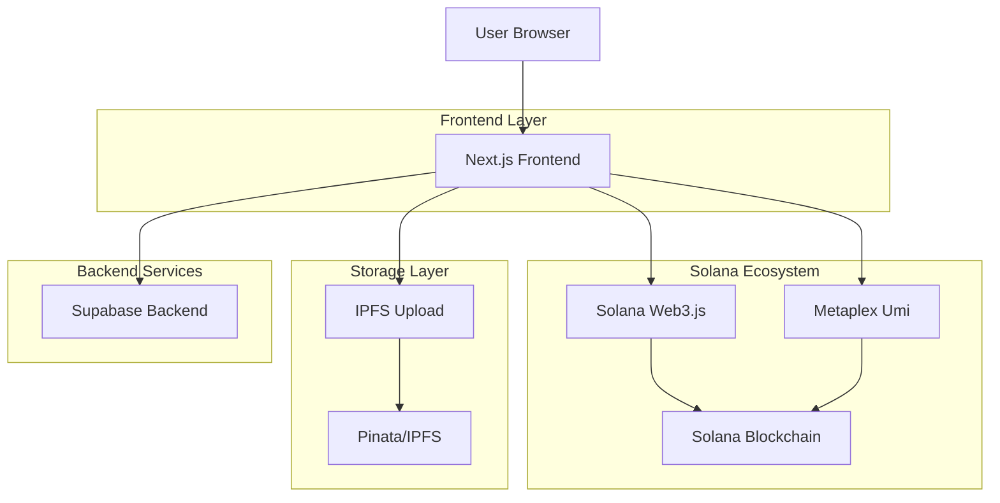
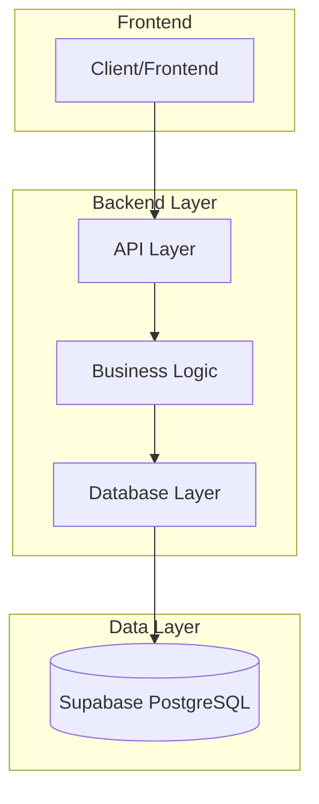
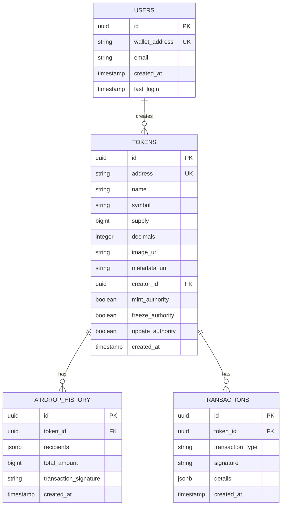

## 1. Arhitectură sistem



## 2. Descriere tehnologii

- Frontend: Next.js 14 + React 18 + TypeScript
- Stilizare: Tailwind CSS 3 + Shadcn/UI
- Blockchain: Solana Web3.js + Metaplex Umi
- Storage: IPFS (Pinata API) pentru metadata și imagini
- Backend: Supabase (PostgreSQL + Authentication)
- Initialization Tool: create-next-app
- Wallet Integration: Wallet Adapter (Phantom, Solflare)
- Form Management: React Hook Form + Zod validation

## 3. Definiții rute

| Rută | Scop |
|-------|---------|
| / | Pagina principală cu statistici și CTA |
| /create | Formular creare token cu toate opțiunile |
| /dashboard | Dashboard utilizator cu token-urile create |
| /token/[address] | Pagina detalii token cu statistici și acțiuni |
| /airdrop | Tool pentru distribuire token-uri multiple |
| /explore | Explorator token-uri populare și recente |
| /api/webhook/solana | Webhook pentru trackere tranzacții |

## 4. Definiții API

### 4.1 API-uri Backend (Supabase)

**Creare token în baza de date:**
```
POST /api/tokens
```

Request:
| Parametru | Tip | Obligatoriu | Descriere |
|-----------|-----|-------------|-----------|
| address | string | true | Adresa token-ului pe Solana |
| name | string | true | Numele token-ului |
| symbol | string | true | Simbolul token-ului |
| supply | number | true | Supply total |
| decimals | number | true | Număr zecimale |
| image_url | string | false | URL imagine IPFS |
| creator_wallet | string | true | Wallet creator |
| metadata_uri | string | false | URI metadate IPFS |

**Salvare airdrop history:**
```
POST /api/airdrops
```

Request:
| Parametru | Tip | Obligatoriu | Descriere |
|-----------|-----|-------------|-----------|
| token_address | string | true | Adresa token |
| recipients | array | true | Listă adrese și cantități |
| total_amount | number | true | Total distribuit |
| transaction_signature | string | true | Semnătură tranzacție |

### 4.2 Tipuri TypeScript comune

```typescript
interface Token {
  address: string;
  name: string;
  symbol: string;
  supply: number;
  decimals: number;
  imageUrl?: string;
  metadataUri?: string;
  creator: string;
  createdAt: Date;
  authorities: {
    mint: boolean;
    freeze: boolean;
    update: boolean;
  };
}

interface AirdropData {
  tokenAddress: string;
  recipients: Array<{
    address: string;
    amount: number;
  }>;
  totalAmount: number;
  status: 'pending' | 'processing' | 'completed' | 'failed';
}

interface CreateTokenForm {
  name: string;
  symbol: string;
  supply: number;
  decimals: number;
  description?: string;
  image?: File;
  revokeMint: boolean;
  revokeFreeze: boolean;
  revokeUpdate: boolean;
}
```

## 5. Arhitectură server



## 6. Model date

### 6.1 Definiție model date



### 6.2 Definiții limbaj DDL

**Tabelă utilizatori:**
```sql
CREATE TABLE users (
    id UUID PRIMARY KEY DEFAULT gen_random_uuid(),
    wallet_address VARCHAR(48) UNIQUE NOT NULL,
    email VARCHAR(255),
    created_at TIMESTAMP WITH TIME ZONE DEFAULT NOW(),
    last_login TIMESTAMP WITH TIME ZONE DEFAULT NOW()
);

CREATE INDEX idx_users_wallet ON users(wallet_address);
```

**Tabelă token-uri:**
```sql
CREATE TABLE tokens (
    id UUID PRIMARY KEY DEFAULT gen_random_uuid(),
    address VARCHAR(48) UNIQUE NOT NULL,
    name VARCHAR(100) NOT NULL,
    symbol VARCHAR(10) NOT NULL,
    supply BIGINT NOT NULL,
    decimals INTEGER NOT NULL DEFAULT 6,
    image_url TEXT,
    metadata_uri TEXT,
    creator_id UUID REFERENCES users(id),
    mint_authority BOOLEAN DEFAULT true,
    freeze_authority BOOLEAN DEFAULT true,
    update_authority BOOLEAN DEFAULT true,
    created_at TIMESTAMP WITH TIME ZONE DEFAULT NOW()
);

CREATE INDEX idx_tokens_creator ON tokens(creator_id);
CREATE INDEX idx_tokens_address ON tokens(address);
CREATE INDEX idx_tokens_symbol ON tokens(symbol);
```

**Tabelă istoric airdrop:**
```sql
CREATE TABLE airdrop_history (
    id UUID PRIMARY KEY DEFAULT gen_random_uuid(),
    token_id UUID REFERENCES tokens(id),
    recipients JSONB NOT NULL,
    total_amount BIGINT NOT NULL,
    transaction_signature VARCHAR(100) NOT NULL,
    created_at TIMESTAMP WITH TIME ZONE DEFAULT NOW()
);

CREATE INDEX idx_airdrop_token ON airdrop_history(token_id);
CREATE INDEX idx_airdrop_created ON airdrop_history(created_at DESC);
```

### 6.3 Politici Supabase RLS (Row Level Security)

```sql
-- Permite citire token-uri tuturor utilizatorilor
ALTER TABLE tokens ENABLE ROW LEVEL SECURITY;
CREATE POLICY "Tokens are viewable by everyone" ON tokens FOR SELECT USING (true);

-- Permite creare token-uri doar utilizatorilor autentificați
CREATE POLICY "Users can create tokens" ON tokens FOR INSERT 
WITH CHECK (auth.uid() = creator_id);

-- Permite update doar creatorului token-ului
CREATE POLICY "Only token creator can update" ON tokens FOR UPDATE 
USING (auth.uid() = creator_id);

-- Politici similare pentru tabelele airdrop_history și transactions
```

## 7. Integrări externe

### 7.1 Solana RPC
- Mainnet: https://api.mainnet-beta.solana.com
- Devnet: https://api.devnet.solana.com
- RPC personalizat pentru performanță optimă

### 7.2 IPFS Storage (Pinata)
- Upload imagini și metadata
- Pinning permanent pentru fișiere
- CDN integration pentru loading rapid

### 7.3 Solana APIs
- Metaplex pentru standard token-uri
- SPL Token Program pentru operațiuni de bază
- Jupiter API pentru prețuri și lichiditate

## 8. Considerații securitate

- Validare strictă a input-urilor cu Zod schemas
- Rate limiting pe API endpoints
- Verificare semnături tranzacții
- Protecție împotriva double-spending
- Monitorizare activități suspecte
- Backup regulat pentru baza de date